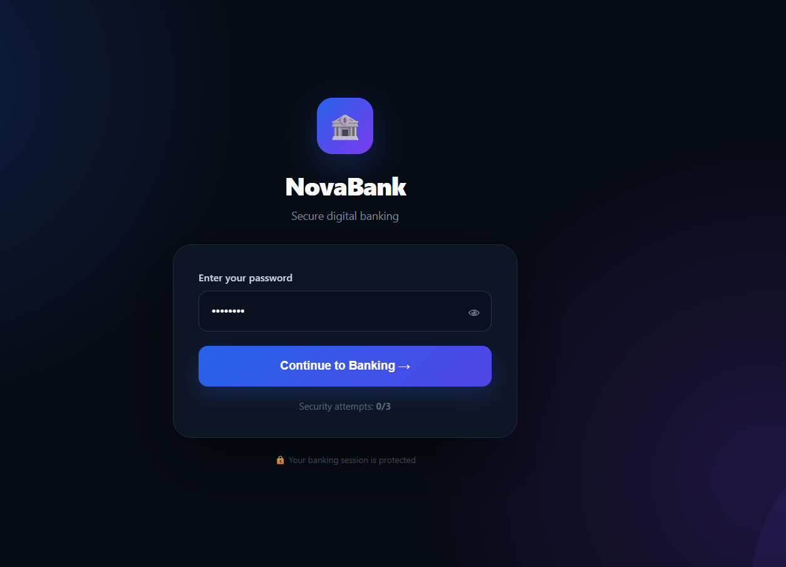
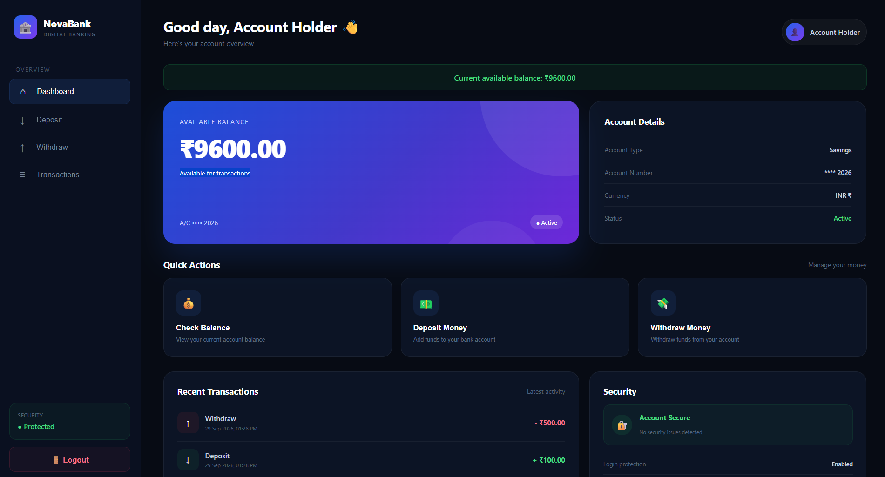
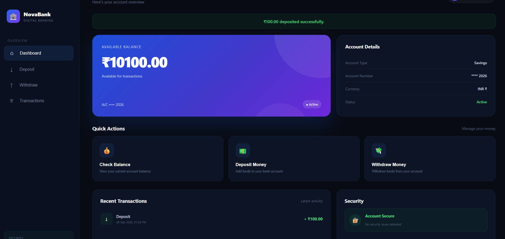
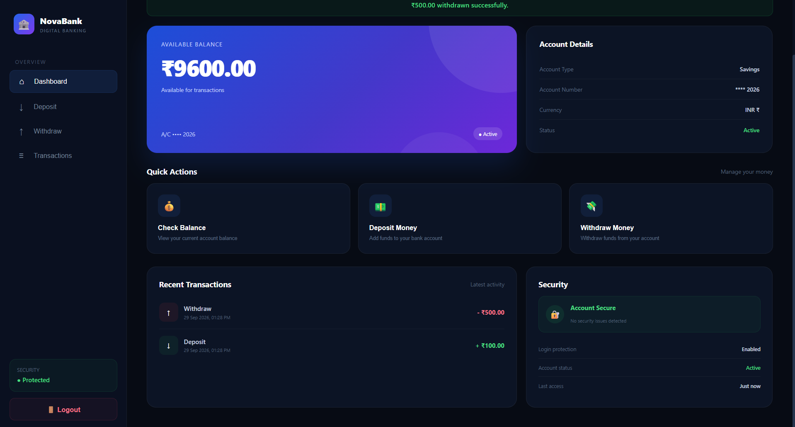

# 🏧 ATM Application

<p align="center">
  
  
  
  
</p>

<p align="center">
  <strong>A simple web-based ATM application built using Python and Flask.</strong>
</p>

<p align="center">
  Perform secure ATM operations such as login, balance checking, deposits, withdrawals, and logout through a simple web interface.
</p>

---

## 📌 About the Project

The **ATM Application** is a web-based banking simulation developed using **Python Flask**.

The project demonstrates how common ATM operations can be implemented through a web application.

Users can log in and perform basic banking operations such as:

- 🔐 User Login
- 💰 Check Balance
- 💵 Deposit Money
- 💸 Withdraw Money
- 📊 View Account Information
- 🚪 Logout

This project was developed as a practical application to understand **Python, Flask, routing, forms, session handling, and web application development**.

---

## 🚀 Features

### 🔐 Login System

Users can log in using their account credentials.

### 💰 Balance Checking

Users can view their current account balance.

### 💵 Deposit

Users can enter an amount and deposit money into their account.

### 💸 Withdrawal

Users can withdraw money from their available balance.

The application checks whether sufficient balance is available before processing the withdrawal.

### 📊 Account Information

Users can view their account-related information through the dashboard.

### 🚪 Logout

Users can safely log out of the application.

---

## 🛠️ Technologies Used

| Technology | Purpose |
|---|---|
| 🐍 Python | Backend programming |
| 🌐 Flask | Web application framework |
| HTML5 | Web page structure |
| CSS3 | User interface styling |
| Jinja2 | Dynamic HTML templates |
| Gunicorn | Production web server |
| Git & GitHub | Version control |
| Render | Deployment |

---

## 📂 Project Structure

```text
ATM-Application/
│
├── new.py
├── requirements.txt
├── README.md
│
├── templates/
│   ├── login.html
│   ├── dashboard.html
│   └── ...
│
└── static/
    ├── style.css
    └── ...
```

> The exact `templates` and `static` files may vary depending on the current version of the application.

---

## ⚙️ Installation & Setup

### 1. Clone the Repository

```bash
git clone https://github.com/YOUR-USERNAME/ATM-Application.git
```

Move into the project directory:

```bash
cd ATM-Application
```

---

### 2. Create a Virtual Environment

Windows:

```bash
python -m venv venv
```

Activate it:

```bash
venv\Scripts\activate
```

For macOS/Linux:

```bash
source venv/bin/activate
```

---

### 3. Install Dependencies

```bash
pip install -r requirements.txt
```

---

### 4. Run the Application

Because the Flask application file is named **`new.py`**, run:

```bash
python new.py
```

The application should start at:

```text
http://127.0.0.1:5000
```

Open the URL in your browser.

---

# 📋 ATM Operations

The application provides the following basic workflow:

```text
             ┌──────────────┐
             │    LOGIN     │
             └──────┬───────┘
                    ↓
             ┌──────────────┐
             │  DASHBOARD   │
             └──────┬───────┘
                    ↓
       ┌────────────┼────────────┐
       ↓            ↓            ↓
   BALANCE       DEPOSIT      WITHDRAW
       │            │            │
       └────────────┼────────────┘
                    ↓
             ┌──────────────┐
             │    LOGOUT    │
             └──────────────┘
```

---

# 💻 Main Functionalities

## Balance

The balance section displays the user's available account balance.

Example:

```text
Current Balance: ₹10,000
```

---

## Deposit

The user enters an amount to add to the account.

Example:

```text
Deposit Amount: ₹2,000

Updated Balance: ₹12,000
```

---

## Withdraw

The user enters the amount they want to withdraw.

The application verifies the available balance before processing the transaction.

Example:

```text
Current Balance: ₹12,000
Withdrawal: ₹3,000

Remaining Balance: ₹9,000
```

If the withdrawal amount exceeds the available balance, the transaction is rejected.

---

# 🔐 Security Considerations

This project is intended for **educational and demonstration purposes**.

For a real banking application, additional security mechanisms would be required, including:

- Password hashing
- Secure session management
- Database-backed accounts
- Transaction authentication
- OTP / MFA
- HTTPS
- CSRF protection
- Input validation
- Rate limiting
- Audit logging
- Secure secret management

**Do not use this project to process real banking transactions or sensitive financial information.**

---

# 🌐 Deployment on Render

The application can be deployed using **Render**.

### Render Configuration

Since the Flask application file is:

```text
new.py
```

use the following configuration:

### Root Directory

Leave it empty if `new.py` is in the repository root.

### Build Command

```bash
pip install -r requirements.txt
```

### Start Command

```bash
gunicorn new:app
```

The format is:

```text
filename:flask_variable
```

Therefore:

```text
new.py
   ↓
new

app = Flask(__name__)
   ↓
app

Gunicorn:
new:app
```

---

# 📦 requirements.txt

Your `requirements.txt` should contain:

```txt
Flask
gunicorn
```

If your application uses additional Python packages, add them to this file as well.

---
## 📸 Screenshots

### 🔐 Login Page

<p align="center">
  
</p>

---

### 🏧 Dashboard

<p align="center">
  
</p>

---

### 💰 Balance

<p align="center">
  
</p>

---

### 💵 Deposit

<p align="center">
  
</p>

---

### 💸 Withdraw

<p align="center">
  
</p>
---

# 🎯 Learning Objectives

This project helped in understanding:

- Python programming
- Flask framework
- Flask routing
- HTTP requests
- HTML forms
- Jinja2 templates
- Session management
- Backend and frontend integration
- Input validation
- Web application deployment
- Git and GitHub
- Render deployment

---

# 🔮 Future Improvements

The project can be extended with:

- 🗄️ MySQL / PostgreSQL database
- 👤 Multiple user accounts
- 🔐 Password hashing
- 🔢 PIN authentication
- 📱 Responsive mobile interface
- 📜 Transaction history
- 🧾 Downloadable transaction statements
- 📧 Email notifications
- 📱 OTP verification
- 📊 Admin dashboard
- 🔒 Improved security
- 💳 Card-based authentication

---

# 👨‍💻 Author

## Bharath M

**B.Tech Information Technology**

### Connect with me

<p align="center">

<a href="https://bharath2005.vercel.app/">
  
</a>

<a href="https://www.linkedin.com/in/bharath-m-87a569259/">
  
</a>

<a href="https://github.com/bharathmurugan">
  
</a>

</p>

---

<p align="center">
  <strong>🏧 ATM Application | Python + Flask</strong>
</p>

<p align="center">
  ⭐ If you found this project useful, consider giving it a star!
</p>
